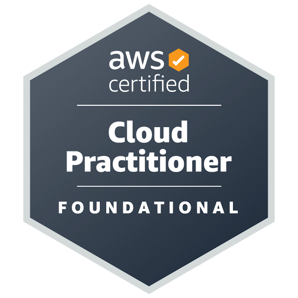
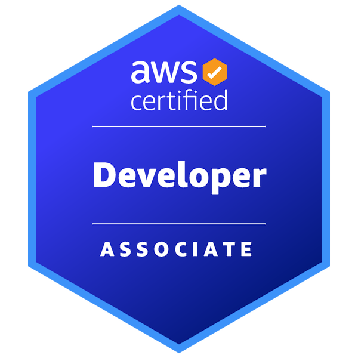
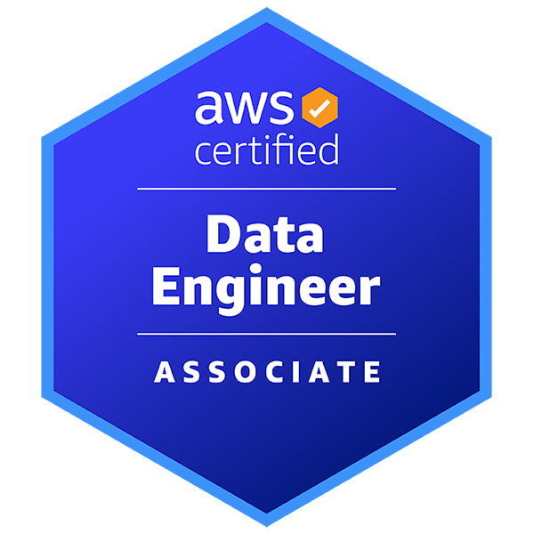

# 👋 Hi, I’m Sanat!

Analyst at Deloitte | 3x AWS Certified | DevOps & Cloud Aficionado | 🎥 YouTuber @Grow With Sanat : AWS & DevOps Tutorials - Helping People to grow in their Life

## 🛠️ Tech Stack :
### Scripting Languages :

### DevOps Tools :
  
  
  
  
  
  
  
I use these tools daily in my DevOps workflow — from writing IaC with Terraform to building CI/CD pipelines with Jenkins, managing containers with Docker, and deploying on AWS.

## 🧠 Certifications :

  
  
  

